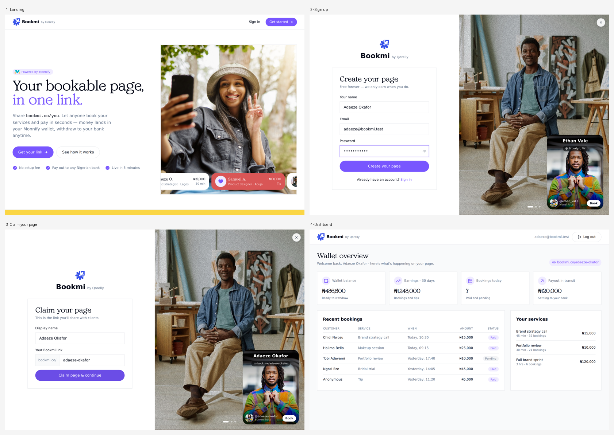

# Step 2 — Playwright, the normal way

You are on the **`step-2-playwright`** branch. The app is the same as step 1;
what's new is a hand-written Playwright suite that depends on CSS selectors.



<sub>The app you'll be testing: landing → sign up → claim your page → dashboard.</sub>

```bash
make install               # pnpm install (workspace: root + demo-app)
pnpm exec playwright install chromium
make test                  # green
```

Then break it on purpose:

```bash
make break-ui              # renames .btn-login-v2, .nav-signin, .dash-title
make test                  # red — but the app still works for humans
make restore-ui
```

Full walkthrough: **[docs/step-2-playwright.md](docs/step-2-playwright.md)**.

## Branches in this codelab

| Branch | What it adds |
|---|---|
| `step-1-manual` | The app only — test it by hand |
| `step-2-playwright` | Hand-written Playwright tests with CSS selectors, and a script that breaks them |
| `step-3-intent` | The same tests written as intent, run by Antigravity CLI (BrowserMCP + Playwright skill) |
| `main` | The final setup: intent files, generated specs, CI workflow, full guide |
